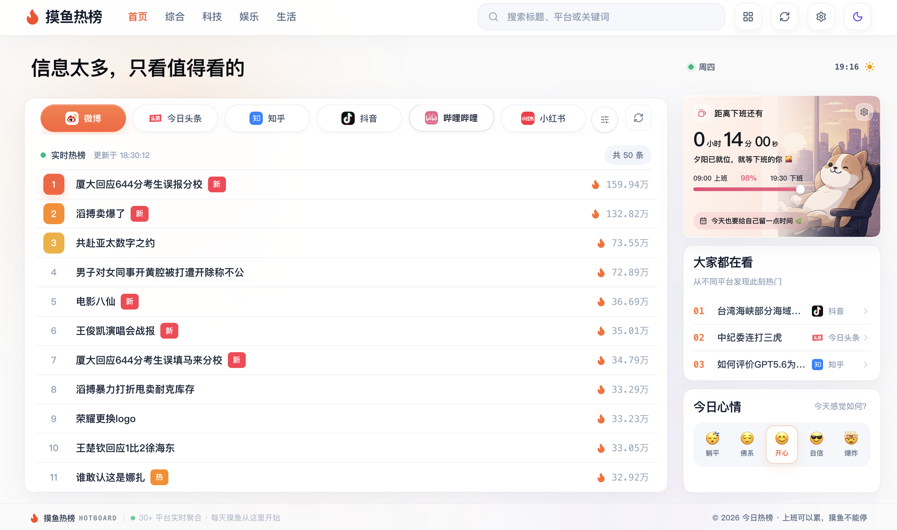
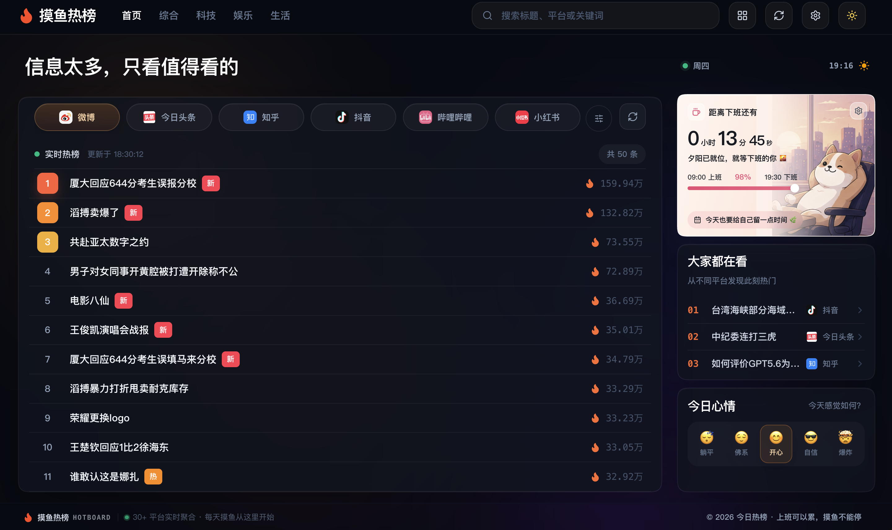

<div align="center">
  
  <h1>HotSearch</h1>
  <p>聚合全网热点，快速浏览 30 个平台的实时榜单</p>
  <p>
    
    
    
    
    
  </p>
  <p>
    <a href="https://hot.dreamf.eu.org/">在线体验</a> ·
    <a href="#项目预览">项目预览</a> ·
    <a href="#功能特性">功能特性</a> ·
    <a href="#支持平台">支持平台</a> ·
    <a href="#本地开发">本地开发</a> ·
    <a href="#部署">部署</a>
  </p>
</div>

---

## 项目简介

HotSearch 是一个基于 Next.js 的现代化热点聚合平台，面向个人部署、热点看板和接口学习场景。

服务端负责读取各平台公开页面或接口，并通过独立适配器统一数据格式；前端负责聚合展示，提供搜索、分组、排序、主题切换和响应式布局等功能。

> 本项目只读取公开榜单，不绕过平台登录或访问控制。榜单能够匿名读取，不代表对应内容详情也一定允许匿名访问。

## 功能特性

- **30 个数据源**：覆盖社区、新闻、科技、视频、娱乐和生活资讯
- **统一数据适配**：平台解析相互隔离，接口返回格式一致
- **稳定请求链路**：内置超时、缓存、并发请求合并和过期缓存回退
- **高效浏览体验**：支持平台分组、搜索、排序、隐藏和重点榜单
- **响应式界面**：适配桌面端与移动端，支持亮色和暗色主题
- **持续验证**：GitHub Actions 自动执行代码检查、测试、构建和依赖审计

## 项目预览

<table>
  <tr>
    <th width="50%">亮色模式</th>
    <th width="50%">暗色模式</th>
  </tr>
  <tr>
    <td><a href="./docs/screenshots/hotsearch-light.png"></a></td>
    <td><a href="./docs/screenshots/hotsearch-dark.png"></a></td>
  </tr>
</table>

## 支持平台

项目当前接入 30 个数据源，统一路由格式为 `/api/<source>`。点击表格中的 API 名称可查看仓库内对应的 TypeScript 路由实现。

| 平台 | 榜单 | 状态 | API |
| --- | --- | :---: | --- |
|  微博 | 热搜榜 | ✅ | [`weibo`](./src/app/api/weibo/route.ts) |
|  小红书 | 实时热榜 | ✅ | [`xiaohongshu`](./src/app/api/xiaohongshu/route.ts) |
|  哔哩哔哩 | 热门榜 | ✅ | [`bilibili`](./src/app/api/bilibili/route.ts) |
|  抖音 | 热点榜 | ✅ | [`douyin`](./src/app/api/douyin/route.ts) |
|  今日头条 | 热榜 | ✅ | [`toutiao`](./src/app/api/toutiao/route.ts) |
|  知乎 | 热榜 | ✅ | [`zhihu`](./src/app/api/zhihu/route.ts) |
|  百度 | 热搜榜 | ✅ | [`baidu`](./src/app/api/baidu/route.ts) |
|  百度贴吧 | 热议榜 | ✅ | [`baidutieba`](./src/app/api/baidutieba/route.ts) |
|  腾讯新闻 | 热点榜 | ✅ | [`qq`](./src/app/api/qq/route.ts) |
|  虎扑 | 步行街热帖 | ✅ | [`hupu`](./src/app/api/hupu/route.ts) |
|  稀土掘金 | 热榜 | ✅ | [`juejin`](./src/app/api/juejin/route.ts) |
|  GitHub | 热门仓库 | ✅ | [`github-trending`](./src/app/api/github-trending/route.ts) |
|  HelloGitHub | 精选 | ✅ | [`hello-github`](./src/app/api/hello-github/route.ts) |
|  CSDN | 热榜 | ✅ | [`csdn`](./src/app/api/csdn/route.ts) |
|  网易新闻 | 热榜 | ✅ | [`netease`](./src/app/api/netease/route.ts) |
|  夸克 | 今日热点 | ✅ | [`quark`](./src/app/api/quark/route.ts) |
|  英雄联盟 | 更新公告 | ✅ | [`lol`](./src/app/api/lol/route.ts) |
|  澎湃新闻 | 热榜 | ✅ | [`thepaper`](./src/app/api/thepaper/route.ts) |
|  快手 | 热榜 | ✅ | [`kuaishou`](./src/app/api/kuaishou/route.ts) |
|  懂车帝 | 热搜榜 | ✅ | [`dongchedi`](./src/app/api/dongchedi/route.ts) |
|  百度百科 | 历史上的今天 | ✅ | [`history-today`](./src/app/api/history-today/route.ts) |
|  微信读书 | 飙升榜 | ✅ | [`weread`](./src/app/api/weread/route.ts) |
|  豆瓣电影 | 新片榜 | ✅ | [`douban-movic`](./src/app/api/douban-movic/route.ts) |
|  网易云音乐 | 热歌榜 | ✅ | [`netease-music`](./src/app/api/netease-music/route.ts) |
|  人人都是产品经理 | 热榜 | ✅ | [`woshipm`](./src/app/api/woshipm/route.ts) |
|  36氪 | 24 小时热榜 | ✅ | [`36kr`](./src/app/api/36kr/route.ts) |
|  虎嗅 | 最新资讯 | ✅ | [`huxiu`](./src/app/api/huxiu/route.ts) |
|  知乎日报 | 推荐榜 | ✅ | [`zhihu-daily`](./src/app/api/zhihu-daily/route.ts) |
|  爱范儿 | 快讯 | ✅ | [`ifanr`](./src/app/api/ifanr/route.ts) |
|  IT之家 | 热榜 | ✅ | [`ithome`](./src/app/api/ithome/route.ts) |

> ✅ 表示适配器与 API 路由已经实现；实际可用性仍受第三方接口、页面结构和访问策略影响。

## 本地开发

### 环境要求

- Node.js 22+
- pnpm 11+

```bash
# 1. 克隆项目
git clone https://github.com/luca-works/hotsearch.git

# 2. 进入项目目录
cd hotsearch

# 3. 安装依赖
pnpm install

# 4. 创建本地配置
cp .env.example .env.local

# 5. 启动开发服务器
pnpm dev

# 6. 浏览器访问
# http://localhost:5173
```

默认配置可直接启动；如需启用本地访问统计，请按下方配置说明修改 `.env.local`。

## 配置说明

### 环境变量

仓库只提供不含敏感值的 `.env.example`。真实配置应保存在 `.env.local` 或部署平台的 Secret 管理中，禁止提交 `.env` 文件。

| 变量 | 默认值 | 说明 |
| --- | --- | --- |
| `APP_PORT` | `18967` | Docker 映射到宿主机的端口 |
| `NEXT_PUBLIC_APP_NAME` | `HotSearch` | 网站名称 |
| `NEXT_PUBLIC_APP_DESC` | `聚合多个公开平台的实时热点` | 网站描述 |
| `NEXT_PUBLIC_APP_URL` | `http://localhost:18967` | 网站公开地址 |
| `NEXT_PUBLIC_COPYRIGHT` | `HotSearch` | 页脚版权名称 |
| `NEXT_PUBLIC_THEME` | `light` | 默认主题，可选 `light` 或 `dark` |

<details>
<summary><strong>本地访问统计</strong></summary>

该能力默认关闭，不影响公开部署。需要在本地启用时，请设置：

```dotenv
ENABLE_LOCAL_STATS=true
ADMIN_TOKEN=请替换为足够长的随机值
VISIT_LOG_PATH=.data/visits.jsonl
VISIT_RETENTION_DAYS=30
VISIT_STORE_RAW_IP=false
```

启用后访问 `/admin/login`。关闭时不加载追踪器，统计接口和管理页面均返回 `404`。

</details>

## API 使用

以微博热榜为例：

```http
GET /api/weibo
```

```json
{
  "code": 200,
  "msg": "请求成功",
  "timestamp": 1784793600000,
  "cached": false,
  "cachedAt": 1784793600000,
  "data": [
    {
      "id": "example-id",
      "title": "热点标题",
      "url": "https://example.com",
      "hot": 10000
    }
  ]
}
```

不同平台可能额外返回 `desc`、`pic`、`author`、`mobileUrl`、`tip` 或 `label` 等字段。上游请求失败且没有可用缓存时，接口返回 `502`，不会伪造榜单数据。

## 部署

### 源码构建

```bash
# 1. 安装锁定版本的依赖
pnpm install --frozen-lockfile

# 2. 创建生产配置并按需修改
cp .env.example .env.local

# 3. 构建生产版本
pnpm build

# 4. 启动生产服务器
pnpm start
```

生产服务器默认监听 `3000` 端口，可通过 `PORT` 环境变量修改，例如 `PORT=18967 pnpm start`。

### Docker Compose

```bash
# 1. 创建生产配置并按需修改
cp .env.example .env

# 2. 构建并在后台启动
docker compose up -d --build
```

默认访问地址为 <http://127.0.0.1:18967>。容器端口只绑定宿主机回环地址，不直接暴露到公网。

```bash
# 停止并移除容器
docker compose down
```

### 反向代理

生产环境建议保留当前的本机端口绑定，由 Nginx、Caddy 或其他网关统一处理域名、HTTPS、访问日志和限流。当前线上地址为 [hot.dreamf.eu.org](https://hot.dreamf.eu.org/)，部署前请设置 `NEXT_PUBLIC_APP_URL=https://hot.dreamf.eu.org`。

下面是通用 Nginx 示例，请自行替换域名：

```nginx
server {
    listen 80;
    server_name hot.dreamf.eu.org;

    location / {
        proxy_pass http://127.0.0.1:18967;
        proxy_http_version 1.1;
        proxy_set_header Host $host;
        proxy_set_header X-Real-IP $remote_addr;
        proxy_set_header X-Forwarded-For $proxy_add_x_forwarded_for;
        proxy_set_header X-Forwarded-Proto $scheme;
    }
}
```

实际公网部署应由反向代理终止 TLS，并将 HTTP 请求重定向到 HTTPS。服务器 IP、证书路径、鉴权信息和管理地址不应提交到仓库。

## 架构与技术栈

项目采用分层结构组织数据获取与页面展示：

1. `src/app/api/` 暴露各平台 API 路由
2. `src/lib/hot-sources/adapters/` 负责请求和解析第三方数据
3. `src/lib/hot-sources/` 统一处理超时、缓存、错误和响应格式
4. `src/components/HotDashboard/` 消费标准化数据并完成界面展示

| 技术 | 版本 | 用途 |
| --- | :---: | --- |
| [Next.js](https://nextjs.org/) | 16.2 | 页面、服务端接口与生产构建 |
| [React](https://react.dev/) | 19.2 | 用户界面与组件状态 |
| [TypeScript](https://www.typescriptlang.org/) | 5 | 类型约束与开发工具链 |
| [Tailwind CSS](https://tailwindcss.com/) | 4 | 全局样式与原子化 CSS |
| [Zustand](https://zustand.docs.pmnd.rs/) | 5 | 客户端偏好状态持久化 |
| [Motion](https://motion.dev/) | 12 | 界面动效与交互反馈 |
| [Cheerio](https://cheerio.js.org/) | 1.2 | 服务端 HTML 内容解析 |

### 目录结构

```text
hotsearch/
├── docs/screenshots/                README 项目预览图
├── public/                         平台图标与静态资源
├── scripts/                        构建辅助脚本
├── src/
│   ├── app/                         Next.js 页面、元数据与 API 路由
│   ├── components/
│   │   └── HotDashboard/           热榜界面
│   └── lib/
│       └── hot-sources/
│           ├── adapters/           平台数据适配器
│           ├── http.ts             HTTP 请求与内容解析
│           └── route.ts            缓存与统一接口响应
├── .env.example
├── docker-compose.yml
└── Dockerfile
```

## 添加数据源

1. 在 `src/lib/hot-sources/adapters/` 中实现平台适配器
2. 在 `src/app/api/<source>/route.ts` 中注册接口路由
3. 在 `public/` 中添加对应平台图标
4. 为解析逻辑和关键链接补充测试
5. 更新本文档中的平台列表

请勿通过硬编码 Cookie、账号信息或绕过平台登录权限的方式获取数据。

## 开发与验证

完成代码或数据源修改后，依次运行：

```bash
pnpm lint
pnpm typecheck
pnpm test
pnpm build
pnpm audit
```

| 命令 | 用途 |
| --- | --- |
| `pnpm lint` | ESLint 代码规范检查 |
| `pnpm typecheck` | TypeScript 类型检查 |
| `pnpm test` | 数据适配器与界面逻辑测试 |
| `pnpm build` | Next.js 生产构建验证 |
| `pnpm audit` | 完整依赖安全审计 |

## 免责声明

本项目仅聚合第三方平台公开提供的标题、热度、摘要和原始链接，不存储目标平台正文，也不保证数据的实时性、完整性或长期可用性。使用者应遵守各数据来源的服务条款、robots 策略及所在地法律法规；因部署或使用本项目产生的风险由使用者自行承担。

## 致谢

感谢以下开源项目为 HotSearch 提供的灵感与技术支持：

- [imsyy/DailyHot](https://github.com/imsyy/DailyHot) — 热点聚合产品设计参考
- [imsyy/DailyHotApi](https://github.com/imsyy/DailyHotApi) — 多平台 API 设计参考
- [Next.js](https://nextjs.org/) — React 全栈应用框架
- [Tailwind CSS](https://tailwindcss.com/) — 原子化 CSS 框架
- [Zustand](https://zustand.docs.pmnd.rs/) — 轻量状态管理
- [Motion](https://motion.dev/) — React 动效与交互
- [Cheerio](https://cheerio.js.org/) — 服务端 HTML 内容解析

当前项目的数据适配、请求缓存、错误处理和界面结构均在本仓库独立维护。

## License

本项目基于 [MIT License](./LICENSE) 开源。
